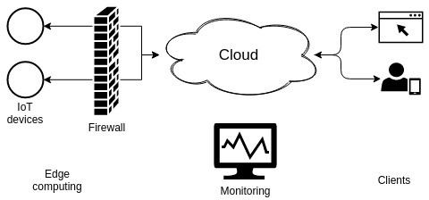
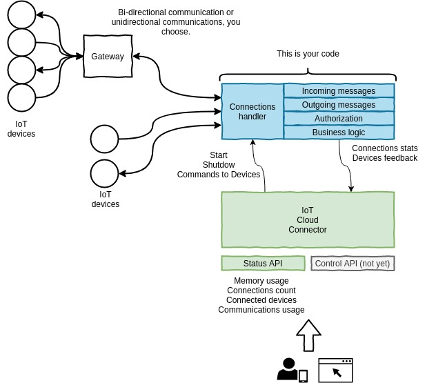

# Project still under development do not use in production

# IoT Cloud Connector
> Realtime communications with your IoT devices over the Internet.

Monitor and control your IoT devices using a simple and tiny helper cloud tool, that lets you 
code your own business logic using [Go](https://golang.org/) programming language.

## Principles

- You may communicate with IoT Devices in a **asynchronous** way.
- You may communicate with IoT Devices in a **synchronous** way.
- You may communicate with IoT Devices in both ways: **asynchronously** and **synchronously**.
- At least one way of communications is required.
- Communications are performed exchanging **[Messages](events/message.go)**.

## Packages (code layers)

| Name | Description |
| ------------- | ------------- |
| bus | [Bus interface](bus/busInterface.go) Where the messages interchanges takes place. Publishing and Subscribing to topics is how you may communicate your processes. |
| connector | [CloudConnector](connector/cloudConnector.go) Orchestrates and handles graceful shutdowns of all services (AKA your business logic handling your IoT devices). |
| entities | [Connection](entities/connection.go) a struct that holds the basic information of an IoT device connection. |
| events | [Message](events/message.go) Struct used for publishing and subscribing to any message bus.|
| services | [Service interface](services/serviceInterface.go.go) Struct that defines the required methods for a service that CloudConnector will need in order to start and gracefully shutdown it.|
| ui | TODO: Needs to be updated. |

## Usage

TODO

# Links

IoT Cloud Connector uses these amazing projects:

- Gorilla Toolkit: https://www.gorillatoolkit.org/
- Logrus: https://github.com/sirupsen/logrus
- gotest.tools: https://github.com/gotestyourself/gotest.tools

# Licensing

Under MIT License, check [License file](./LICENSE)
