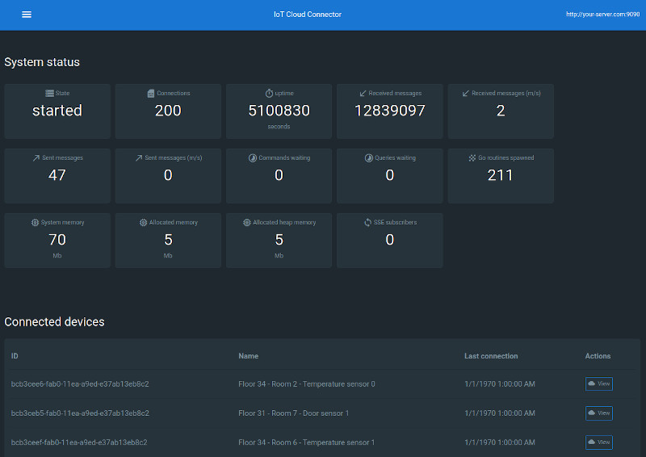
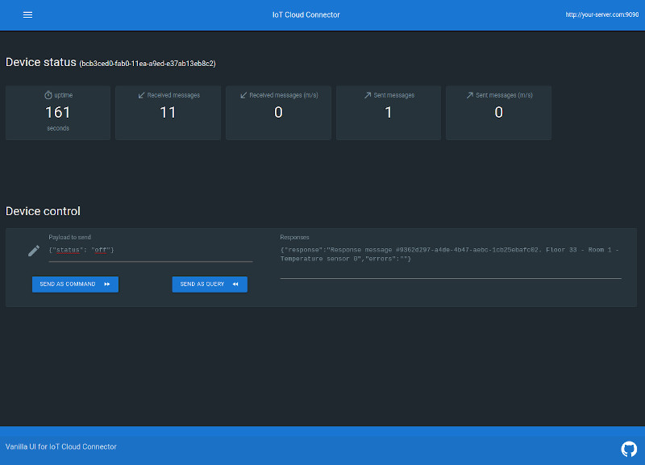

# Project still under development do not use in production

# IoT Cloud Connector
> Realtime communications with your IoT devices over the Internet.


Monitor and control your IoT devices using a simple and tiny helper cloud tool, that lets you 
code your own business logic using [Go](https://golang.org/) programming language.

## Principles

- You may communicate with IoT Devices in a **asynchronous** way.
- You may communicate with IoT Devices in a **synchronous** way.
- You may communicate with IoT Devices in both ways: **asynchronously** and **synchronously**.
- At least one way of communications is required.

## Concepts

- Asynchronous communications are performed via **Messages** exchanges.
- IoT devices, may send **Messages** to the cloud whenever they want, you just **handle these messages**.
- Synchronous communications are performed via **Commands** and **Queries**.
- If you want to synchronously alter the state of your IoT devices, **send them a Command**.
- If you want to synchronously retrieve data from your IoT devices, **send them a Query**.
- **IoT Cloud Connector** helps you to start the server, monitor its status a gracefully shut it down.

## Packages (code layers)


| Name | Description |
| ------------- | ------------- |
| servers | [IoT Cloud Connector](servers/cloudConnector.go) code and [REST API interface](servers/cloudConnectorAPIInterface.go) with an out of the box [API implementation](/docs/default-cloud-connector-api.md) |
| connectionshandlers | [Interfaces](connectionshandlers/connectionsHandlerInterface.go) needed by Cloud Connector, that you have to implement in order to have your own communications. Also an out of the box [websockets implementation](connectionshandlers/websocketsHandler.go) where you can inject your own business logic, is provided. |
| connections | [Structs and interfaces](connections/deviceConnection.go) in order to store IoT Devices connections information. |
| storage | [Interfaces](storage/deviceConnectionsStorageInterface.go) that you will have to implemente in order to store connections information and an out of the box in memory implementation. |
| ui | Vanilla UI, a Vanilla Javascript user interface, that connects to an IoT Cloud Connector instance, via our [out of the box API](/docs/default-cloud-connector-api.md) that shows you information regarding connected devices and allows to send them queries and commands. |





## Usage

What you **must** code to make it work:


1. A **modules definition** for your project [go.mod](https://blog.golang.org/using-go-modules) file:

```
go 1.13

require (
    github.com/nnset/iot-cloud-connector
    github.com/sirupsen/logrus v1.4.2
)

```

2. A **connections handler** that will define the communications protocol between your IoT devices and Cloud Connector.

Your handlers must implement [connectionshandlers.ConnectionsHandlerInterface](connectionshandlers/connectionsHandlerInterface.go). Check [websockets sample](connectionshandlers/sampleWebsocketsHandler.go) for an example.


3. Your own **package** or main.go file:

```go
package main

import (
    "fmt"
    "os"

    "github.com/nnset/iot-cloud-connector/connectionshandlers"
    "github.com/nnset/iot-cloud-connector/servers"
    "github.com/nnset/iot-cloud-connector/storage"
    "github.com/sirupsen/logrus"
)

func main() {
    log := createLogger()

    // IoT devices will connect to localhost:8080
    connectionsHandler := connectionshandlers.NewSampleWebSocketsHandler(
        "localhost", "8080", "tcp", "", "",
    )

    cors := servers.CrossOriginResourceSharing{
        Headers: "Content-Type, Access-Control-Request-Method, Authorization",
        Origin:  "mysite.com",
    }

    // A default REST API will be available at localhost:9090
    // with no authorization required.
    // Check servers.authentication.go for more build in authentication methods
    defaultAPI := servers.NewDefaultCloudConnectorAPI(
        "localhost", 
        "9090", 
        "", 
        "", 
        &servers.APINoAuthenticationMiddleware{}, 
        &cors
    )

    s := servers.NewCloudConnector(
        log, connectionsHandler, storage.NewInMemoryDeviceConnectionsStorage(), defaultAPI,
    )

    s.Start() // Will block flow until an operating system signal is received

    os.Exit(0)
}

func createLogger() *logrus.Logger {
    var log = logrus.New()

    log.SetLevel(logrus.DebugLevel)
    log.Out = os.Stderr

    file, err := os.OpenFile("../var/log/sockets.log", os.O_CREATE|os.O_WRONLY|os.O_APPEND, 0666)

    if err == nil {
        log.Out = file
    } else {
        fmt.Println("Using stdErr for log")
    }

    return log
}

```

4. Finally type:

```
    $ go get

    $ go build

    $ ./your_app
```

**Optional steps**

- An implementation of [storage.DeviceConnectionsStorageInterface](storage/deviceConnectionsStorageInterface.go)
    - Check [in memory implementation](storage/inMemoryDeviceConnectionsStorage.go) for an example.
- An implementation of servers.CloudConnectorAPIInterface
    - Check [default REST API](servers/defaultCloudConnectorAPI.go) for an example.

## Developing your own logic

### Structs

#### servers.CloudConnector

> You can see this as the control layer. It starts and stops the service and helps CloudConnectorAPIInterface to fetch information.

Source [cloudConnector.go](servers/cloudConnector.go)

**Features**

Starts all functional layers:

* ConnectionsHandler (Your business logic)
* CloudConnectorAPI (Your own or a [default one](/docs/default-cloud-connector-api.md))

Handles:

* Server shutdown when a os.signal is sent to stop the process. CloudConnector performs a graceful shutdown for all layers but, if this timeouts, shutdown is enforced.
* Holds Connections stats (via an instance of storage.DeviceConnectionsStorageInterface)
* Start REST API server and supports it making connection stats data available to it.


#### connections.DeviceConnection

> Information regarding each IoT device connection. All these fields are then used to report
how a connection is behaving.

Source [deviceConnection.go](connections/deviceConnection.go)


#### connections.DeviceConnectionDTO

> A Data Transfer Object that encapsulates a device connection information.

Source [deviceConnectionDTO.go](connections/deviceConnectionDTO.go)


### Interfaces

Use all these interfaces to fully customize your logic. We also offer some ready to use 
implementations.


#### connectionshandlers.ConnectionsHandlerInterface

> Implementing your own ConnectionsHandlerInterface allows you to code any 
kind of business rules you need to manage your IoT devices.

Source [connectionsHandlerInterface.go](connectionshandlers/connectionsHandlerInterface.go)


For Start() method, these two channels are important:

| Name | Description |
| ------------- | ------------- |
| shutdownChannel  | ConnectionsHandler only reads from it. When a message is received means that service must shutdown so you should perform a graceful shutdown of all the connections and if you need, report the in progress shutdown to other services in your infrastructure. |
| shutdownIsCompleteChannel  | ConnectionsHandler on writes on it. A message must be added only when ConnectionsHandler has completed its shutdown procedure. |


#### storage.DeviceConnectionsStorageInterface

> How individual IoT devices connections stats are stored offering some global stats as well.

Source [deviceConnectionsStorageInterface.go](storage/deviceConnectionsStorageInterface.go)

Check a ready to use thread safe in memory implementation at [storage.InMemoryDeviceConnectionsStorage](storage/inMemoryDeviceConnectionsStorage.go)


#### servers.CloudConnectorAPIInterface

> Each Cloud Connector instance has a build in REST API where users may fetch information regarding
connector status and current connections.

Source [cloudConnectorAPIInterface.go](servers/cloudConnectorAPIInterface.go)

However you may want to offer your own API, thats fine just implement this interface and pass the instance
to Cloud Connector.

For authentication methods, we provide some options compatible with 
the Default API. Check [authentication.go](servers/authentication.go).

For [CORS](https://developer.mozilla.org/en-US/docs/Web/HTTP/CORS) settings use
[CrossOriginResourceSharing](servers/authentication.go) struct

We provide a default REST API for Cloud Connector check the [documentation here](/docs/default-cloud-connector-api.md).

# Links

IoT Cloud Connector uses these amazing projects:

- Gorilla Toolkit: https://www.gorillatoolkit.org/
- Logrus: https://github.com/sirupsen/logrus
- gotest.tools: https://github.com/gotestyourself/gotest.tools

# Licensing

Under MIT License, check [License file](./LICENSE)
